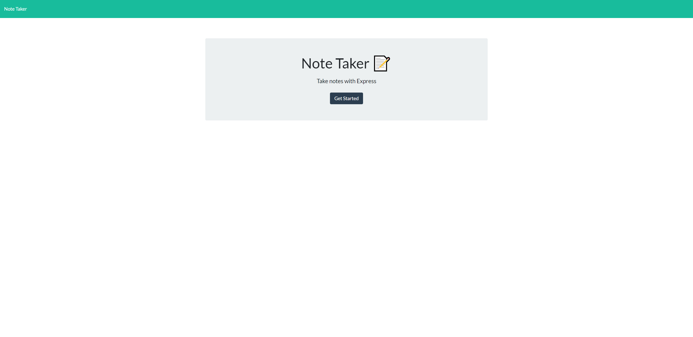
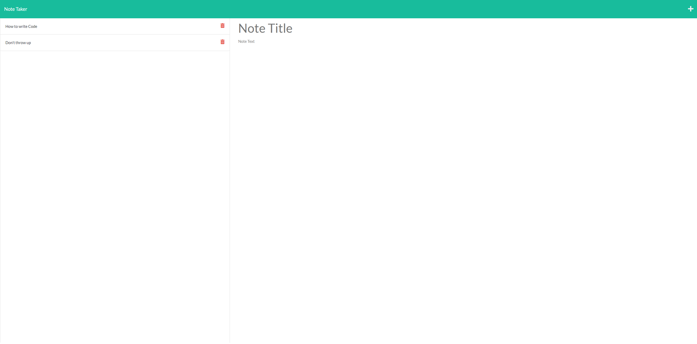

# Note Taker App

An application that utilizes fs, express, path, util, and uuid in order to create and store notes.

## Table of contents

- [Installation](#installation)
- [Usage](#usage)
- [Test](#test)
- [Credits](#credits)
- [License](#license)
- [Contribute](#contribute)
- [Questions](#questions)

## Installation

First, open up the terminal and run "npm i" then "npm install express fs util uuid path" if not already installed.

## Usage

First navigate to the app <a href="https://jimmy-takes-notes.herokuapp.com/">here </a>. Click on "Get started button". Type in name of note and body of note and click save to save the note to left hand side. Click on saved note title on left hand side to pull up the saved note.

## Test

If you would like to run some tests, please input the following command:
There are not tests to run.

## Credits

I would like to thank My friends, family, and instructors at UCSD bootcamp. for their support during the development of this application.

## License

This project is licensed under None.

## Questions

If you have any questions, please direct them towards my email at Jimmyqv.tran@gmail.com.  
 You can find more of my work at github.com/yippeejimmee.

